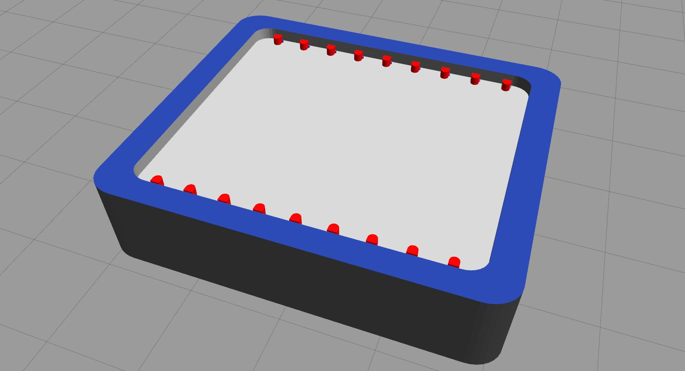

# ros2_robotarium

`ros2_robotarium` is a series of ROS2 packages aimed at bringing a 3D simulation of the [Georgia Tech Robotarium](https://www.robotarium.gatech.edu/) for the following novices, researchers, and enthusiasts:

* New roboticists that would like an easy-to-use ROS2 multi-robot system with a real-world physical counterpart to apply your algorithms or learn.
* 3D simulation needs for those who feel the current Robotarium 2D simulator may be lacking.
* Swarm Robotics researchers particularly those trying to work with machine learning and reinforcement learning algorithms.

In essence, the goal of this project is to create an easy, ready-to-use 3D multi-robot simulator that is built with ROS2 and Gazebo for simulation of Swarm Robotics reinforcement learning experiments. Another goal of this project is to provide an easy python scripting paradigm built upon the [Robotarium's 2D Python simulator's](https://github.com/robotarium/robotarium_python_simulator) for those who do not know how to program using ROS. This way users of varying skill levels in programming and robotics can use this repository for experimentation or learning!

## Installation

The package has been tested to work on **ROS2 Foxy** and **Gazebo >10** for **Ubuntu 20.04**. Future or previous versions may work, but they may require tinkering if errors pop-up!

### Install ROS2

[This](https://index.ros.org/doc/ros2/Installation/Foxy/) link will direct you to the installation instructions for the latest version of ROS2 (Foxy). Please follow the instructions and install the right version for your system.

### Create a ROS2 Workspace

Create a workspace using the following command:

```bash
~$ mkdir -p ~/robotarium_ws/src
```

Next, change directory (`cd`) to `src` directory you just created:

```bash
~$ cd ~/robotarium_ws/src
```

Clone this repository within the `src` folder:

```bash
~$ git clone -b foxy-devel https://github.com/zmk5/ros2_robotarium.git
```

Finally, change directory back to `robotarium_ws`, build using `colcon`, and source the newly built files for use:

```bash
~$ cd ..
~$ colcon build --symlink-install
~$ . install/setup.bash
```

### Change RMW Implementation (Optional)

This is an optional change to the installation, but I noticed that using the *Eclipse DDS Cyclone* ROS2 middleware implementation (this is what RMW stands for btw) tends to lower CPU usage of my simulations, *especially* with a lot of robots. To change your RMW Implementaton, run the following command before each use:

```bash
~$ export RMW_IMPLEMENTATION=rmw_cyclonedds_cpp
```

If you want to make this more permanent, run the following command which will add it to your `.bashrc` file. **Make sure to only run this once!**

```bash
~$ echo 'export RMW_IMPLEMENTATION=rmw_cyclonedds_cpp' >> ~/.bashrc
```

## Running your first simulation

Before running the simulation, export the location of the GRITSBot and Robotarium arena models provided by the package so Gazebo knows where to locate them:

```bash
~$ export GAZEBO_MODEL_PATH=$GAZEBO_MODEL_PATH:~/robotarium_ws/src/ros2_robotarium/robotarium_gazebo/models
```

If you would like to make this permanent, add it to your `.bashrc` file. **Make sure to only run this once though!**

```bash
~$ echo 'export GAZEBO_MODEL_PATH=$GAZEBO_MODEL_PATH:~/robotarium_ws/src/ros2_robotarium/robotarium_gazebo/models' >> ~/.bashrc
```

Now you can run a test simulation with the following command:

```bash
~$ ros2 launch robotarium_bringup spawn_robotarium.launch.py
```

You should get the following arena:



Congratulations! You have now started your first ROS2 Robotarium simulation!


## Running an example code

Provided within this metapackage is an additional one called `robotarium_examples` containing a series of example code provided by the original Georgia Tech 2D `robotarium-python-simulator`. This code is unmodified except for syntax fixes and rearrangement to conform to a ROS2 package structure. These examples provided by the Robotarium team are a great resource to learn how to move the robots within the arena.

The example we will run now is the `si_go_to_point` example. This will make 5 robots move move to a randomly generated point on the Robotarium arena using a single-integrator controller. To run the example, make sure you spawned the Robotarium like in the previous example, and run:

```bash
~$ ros2 run robotarium_example si_go_to_point
```

And now you will notice 5 robots begin moving to points on the arena!

## Tutorials

**UNDER CONSTRUCTION**

## Citation

If you do plan on using this system, I urge you to cite the original Robotarium if you can!

[Here is the paper!](https://liwanggt.github.io/files/Robotarium_CSM_Impact.pdf)
